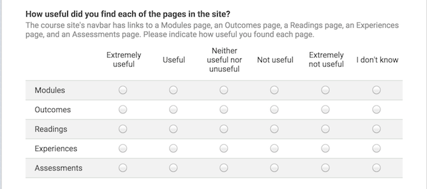
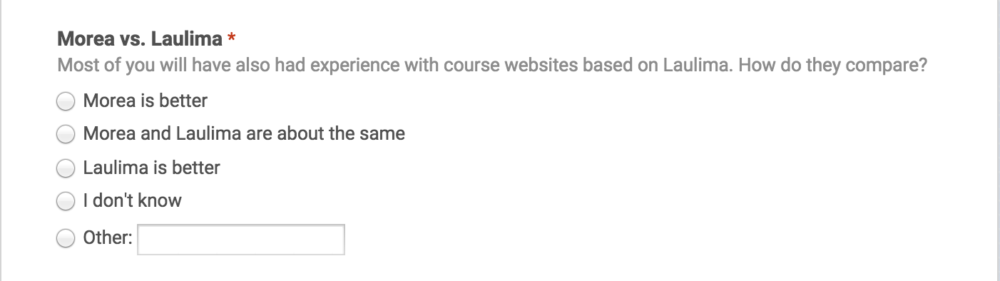

# User Evaluation of the Morea Framework 

## Summary

In May, 2015, the instructors for five courses whose websites were built using the Morea Framework asked their students to fill out an online survey asking their opinion of the course website. Out of the 175 students who received the request, 119 responded, for a participation rate of 68%. One course was 200 level, two were 300 level, one was 400 level, and one was a 600 (graduate) level. Four of the courses were in the Department of Information and Computer Sciences, and one was in the Department of Information and Technology Management. All were at the University of Hawaii.

The goal of the survey was to determine if end-users find that the Morea Framework provides a useful alternative to learning management systems such as Laulima.  And if so, what changes or enhancements would end-users find desirable. 

Survey results indicate that user satisfaction with the Morea Framework course websites is quite high: 70% of respondents prefer it to Laulima in particular and 63% find it easier to use than other course websites in general.

In conclusion, the evidence from this survey suggests that the Morea Framework does provide a useful  approach to course website design and that further development and use is warranted.

The following sections present the survey data in more detail. 

## Question 1: Evaluation of Morea page structure

While instructors are free to customize the top-level page structure of a Morea website, all of the instructors in this survey chose to retain the "standard" five pages (though all did augment them with additional pages). The first question asked users to evaluate the usefulness of the five standard Morea pages:

Here is a summary of the responses:

These results show that most users found all of the standard Morea pages to either useful or extremely useful. The standard pages did differ with respect to the minority opinion:  while all of the respondents except one found the Modules page to be at least useful, 9% found the Outcomes page to not be useful.
  
The free text responses below will provide further insight into the usefulness of the Morea standard pages and how they can be improved.

## Question 2: Morea vs. Laulima

[Laulima](https://laulima.hawaii.edu/portal) is the learning management system provided to all faculty at the University of Hawaii, and so most students in this survey have prior experience using it.  Laulima is less "opinionated" than Morea in that it does not require instructors to organize their course materials into modules that are themselves composed of outcomes, readings, experiences, and assessments.  Laulima also provides functionality not available in Morea, such as automated assignment submission and a gradebook.  This question asked users to compare Morea to Laulima:

Here is a summary of the results:

Despite the fact that Laulima was probably more familiar to users, and that it provided more functionality, 70% preferred Morea to Laulima and only 3% preferred Laulima to Morea.

The free text responses below will provide further insight into this response, and suggests that the strong preference for Morea results at least in part from its "opinionated" nature: users like the organization imposed on course materials by Morea. 
