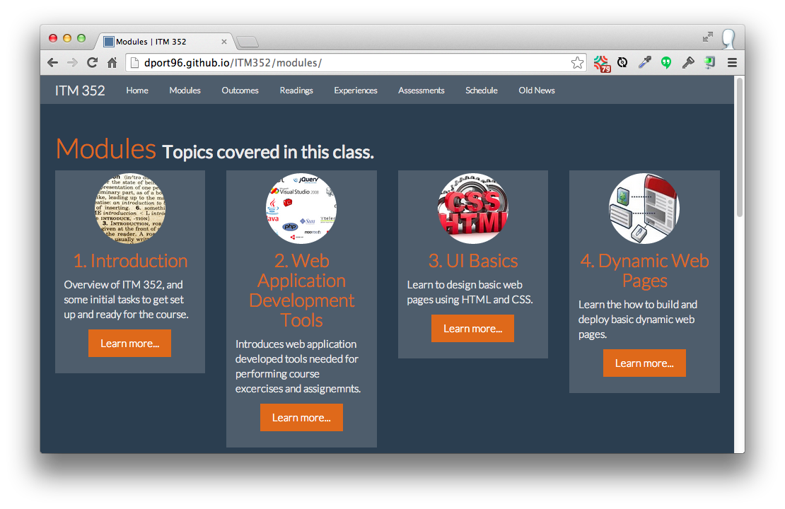

<h1>Morea Gallery</h1>

This page provides pointers to websites developed with Morea.  Please contact us if you want your site included.

<h2>Basic Template</h2>

  

    
  

  

   

   The basic-template implements a "Hello World" version of a Morea website.
   

   

   If you are starting a Morea website from scratch, this gives you a simple example with which to start.
   

   

     <a href="http://morea-framework.github.io/basic-template/" class="btn btn-primary btn-md" role="button">Live site  </a>
     <a href="https://github.com/morea-framework/basic-template" class="btn btn-primary btn-md" role="button">Github repo  </a>
   

  

<h2>ICS 314, Fall 2013</h2>

  

    
  

  

   

   The original itch that the Morea Framework was designed to scratch: how to properly document
    an "athletic" approach to software engineering education?

   

   This site illustrates how outcomes and assessments can work together to provide insight into the
   effectiveness of the course structure.  It also shows some design features of the Morea Framework
   (navbar extensions, include templates for customized pages, responsive embedded videos, and the
   "SuperHero" theme.)
   

   

     <a href="http://philipmjohnson.github.io/ics314f13/" class="btn btn-primary btn-md" role="button">Live site  </a>
     <a href="https://github.com/philipmjohnson/ics314f13" class="btn btn-primary btn-md" role="button">Github repo  </a>
   

  

<h2>ICS 211, Leeward Community College, Fall 2014</h2>

  

    
  

  

   

      Second semester introduction to programming in Java. 

   

   Another version of ICS 211, taught at a community college.  Compare to the UH Manoa site to see 
   similarities and differences between the two courses. 
   

   

     <a href="http://billlymacc.github.io/ics211-fall2014/" class="btn btn-primary btn-md" role="button">Live site  </a>
     <a href="#" class="btn btn-default btn-md" role="button">Private repo!</a>
   

  

<h2>ICS 215, Fall 2014</h2>

  

    
  

  

   

   ICS 215 is a sophomore level course on scripting.

   

   This site illustrates the "Flatly" theme and a Schedule page.  
   

   

     <a href="http://cammoore.github.io/ics215f14/" class="btn btn-primary btn-md" role="button">Live site  </a>
     <a href="#" class="btn btn-default btn-md" role="button">Private repo!</a>
   

  

<h2>ICS 311, Spring 2014</h2>

  

    
  

  

   

   A partial implementation of an undergraduate algorithms class.
   The modules, readings, and experiences are all implemented. 

   

   This site illustrates the addition of a drop-down menu to the navbar, a News page, and the "Simplex" theme. 
   

   

     <a href="http://philipmjohnson.github.io/ics311s14/" class="btn btn-primary btn-md" role="button">Live site  </a>
     <a href="https://github.com/philipmjohnson/ics311s14" class="btn btn-primary btn-md" role="button">Github repo  </a>
   

  

<h2>ITM 352, Fall 2014</h2>

  

    
  

  

   

   A web application programming class taught using PHP in the Shidler School of Business, UH Manoa. 

   

   Like ICS 314, this class is taught using the "athletic software engineering" pedagogy.
   

   

     <a href="http://dport96.github.io/ITM352" class="btn btn-primary btn-md" role="button">Live site  </a>
     <a href="#" class="btn btn-default btn-md" role="button">Private repo!</a>
   

  

<h2>Bus 621, Fall 2014</h2>

  

    
  

  

   

   A business statistics class in the Shidler School of Business, UH Manoa. 

   

   
   

   

     <a href="http://dport96.github.io/BUS621-DLEMBA-F14/" class="btn btn-primary btn-md" role="button">Live site  </a>
     <a href="#" class="btn btn-default btn-md" role="button">Private repo!</a>
   

  

