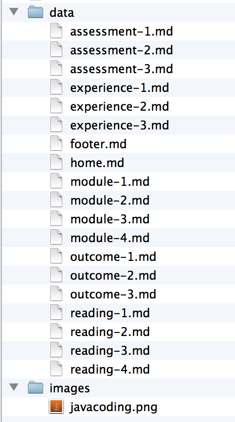

# Basic concepts

To begin, here are the most important principles underlying the framework.

**Morea defines five "entity types": module, outcome, reading, experience, and assessment.**

A _module_ is a container that holds a set of outcomes, readings, experiences, and assessments related
to course content. Modules have a sort order, which allows you to organize modules into a sequence. Most
courses consist of 6 to 30+ modules.  A module can contain zero to many instances of outcomes, readings,
experiences, and assessments. It is possible to define a module without zero outcomes, zero readings, zero experiences,
and zero assessments, though we're not sure of the utility of such a module.

An _outcome_ represents some kind of knowledge or capability that the student should acquire as a result of
the readings and experiences in the associated module.  A module can have multiple outcomes.  Conversely, the same
outcome can be associated with multiple modules. We find that a useful way to organize and express learning outcomes
 is through [Bloom's revised taxonomy](http://www.utar.edu.my/fegt/file/Revised_Blooms_Info.pdf), which classifies
 outcomes into six categories: remembering, understanding, applying, analyzing, evaluating, and creating. The latter outcomes
 (analyzing, evaluating, and creating) are supposed to represent "high-order" cognitive skills.

A _reading_ is an artifact that the student studies: it represents "passive" learning. Readings are typically
chapters in a book, online web pages, and so forth.

In contrast to a reading, an _experience_ represents a more "active" form of learning in which the student solves
problems or performs other activities in order to acquire understanding and capability. Morea distinguishes between
readings and experiences because modules that contain only readings without experiences will tend to have outcomes associated
with lower levels of Bloom's taxonomy, while modules containing a mixture of readings and experiences are more
likely to support outcomes at higher levels of Bloom's taxonomy.

An _assessment_ is an activity that evaluates the success of the student in achieving the educational goals
of the module.  In the best case, the educational goals of the module are adequately expressed by learning outcomes,
in which case each assessment should relate to one or more outcomes.  The graphic
[Applying Bloom's Taxonomy in your Classroom](images/Stobaugh_BloomsTaxonomy.png) provides various examples of how
outcomes and assessments can be linked together.  While Morea can help make linkages between outcomes and
assessments clear, it is common to assess skills not encapsulated by outcomes, or desire outcomes that are not
assessed.

**Morea generates five "views" of the content, each organized according to an entity.**

Morea sites contain a navigation bar at the top of the page with links to pages that organize the content
according to each of the five entities: modules, outcomes, readings, experiences, and assessments.
For example, here is an example of the Readings page:

And here is an example of the Outcomes page:

You can see that the two pages highlight a single entity type but provide links to other entities for context.

We believe that presenting the content organized according to different entity types makes it easier for
students and educators to understand the conceptual structure of the course.   For educators, it also
provides a useful way to see if the course is structurally coherent. For example, when the learning
objectives are examined together, do they create a coherent set?   For another example, are there assessments for each module,
and if not, is that appropriate?

**Every Morea entity has its own markdown file.**

Every instance of a Morea entity (module, outcome, reading, experience, assessment) is represented by a single markdown file.
There can also be other markdown files and other non-markdown files (such as the logo image file associated with each module).

**All of your course content is located in the src/morea/ directory.**

When you first clone a Morea site, you will find a potentially bewildering number of files and directories. For example:

This organization exists because the Morea framework is basically just a Jekyll site with a custom plugin to process the Morea markdown files.

Fortunately, the only files you will typically need to manage are all located in the src/morea directory. Here is
an example of the src/morea directory from the basic-template system:

This folder contains all of the files you will want to manage as part of your course content.

**You can organize the src/morea/ directory any way you like.**

The Morea framework does not care how you organize the files within the src/morea directory.
For example, you can place all of your files at the top level of this directory.
Alternatively, and more typically, you can create subdirectories within the src/morea directory, one
per module, as shown in the previous screenshot.

In addition, Morea does not care how you name files.  In fact, it is
possible to use the same file name in multiple modules (i.e. foo/module.md, bar/module.md, baz/module.md, and
qux/module.md in the screenshot above)

**It is the "front matter" in each Morea entity file that uniquely identifies it.**

Morea does not care about directory structure nor file name, because it uses the _front matter_ in the
markdown file to uniquely identify each Morea entity and determine how they relate to each other.
"Front matter" is a [Jekyll](http://jekyllrb.com/) term for key-value pairs
represented via YAML notation and separated from the rest of the file contents by three dashes. For example,
here is the front matter for a hypothetical module entity:

    ---
    title: "Learn to Foo"
    morea_id: foo
    morea_outcomes:
      - foo-outcome1
      - foo-outcome2
    morea_readings:
      - foo-reading
    morea_experiences:
      - foo-experience
    morea_assessments:
      - foo-assessment
    morea_type: module
    morea_icon_url: /morea/images/foo.png
    morea_labels:
      - required
      - intro
    morea_sort_order: 2
    ---

So, even though each module (foo, bar, baz, qux) in the basic template system contains a file with the name module.md,
the front matter in that file will be different in order to represent the unique structure of the four modules.

Note that while you _can_ use the same file name, you _don't have to_.   You could name the file containing the front
matter for the Foo module "module-foo.md".  You could even name it "outcome.md" (although that would be really
confusing.) The point is:  Morea does not utilize file name information.

We will explain the front matter in more detail later in this User Guide.

**Morea makes a "mirror image" of the src/morea directory in the published HTML site.**

Because we want you to provide course content in the src/morea directory, and because course content can include
(for example) image files, Morea creates a kind of "mirror image" of the src/morea directory in the published site
so that your content can include links within itself as well as to external sites.

The basic rule is that markdown files are converted to HTML in the published site, and all other files get copied
over without change. So, for example, here is the src/morea directory (on the left) and the site's published morea directory
(on the right):

As you can see, the markdown files have become HTML, and the sole non-markdown file (logo.png) has been copied over
unchanged.  The directory structure below the morea/ directory is unchanged.

# Related systems

Another way to understand Morea is by contrasting it with other tools used by educators to create course content.

[GitBook](http://www.gitbook.io/), like Morea, creates educational websites using Markdown and Git.  If you want to
write a textbook, GitBook is a better choice.  Morea is preferred when you want to create a course curriculum from
a variety of sources including your own and/or other sources, and when you want to make learning objectives and
assessments explicit.

[Blackboard](http://www.blackboard.com/) is a commercial offering that provides comprehensive support for all
aspects of course management: content management, testing, grading, etc.
Morea provides a small subset of the capabilities of Blackboard, but is free, simpler to use, and facilitates
sharing through its underlying use of Git and GitHub.  Morea is oriented toward "public" materials, since by default
the materials you create can be accessed by anyone.

[Metacademy](http://www.metacademy.org/) is a site for community curated educational content.  Unlike Morea,
Metacademy supports a single version of curriculum material for any given topic.  In contrast, Morea tries to make it
as easy as possible for each educator to have their own, slightly (or radically) different version of curriculum
material for any given topic.  It's much like the difference between centralized version control (i.e. SVN) where there is
always a single "golden" version of a system, and distributed version control (i.e. git) where there can be many "different
but equal" versions of a system.

If you know of a related system, please let us know and we'll include it here.

# Anatomy of a Module

This section overviews the structure of the module [Foo](https://github.com/morea-framework/basic-template/tree/master/src/morea/foo) in the [basic-template](https://github.com/morea-framework/basic-template) system.  Here is a
graphic to help illustrate the various components:

 

The top row illustrates various "source" files, and the bottom row illustrates various "output" HTML pages
produced from these files.

The top right window shows the contents of the src/morea/foo directory. This directory defines
the content associated with the Foo module.  Note that the directory contains two files that are
not associated with the Foo module.  This is unusual but permissible in Morea.

The second window on the top row shows the content of module.md.  The content of this file is mostly Front Matter,
and provides the definition of the Foo module.  The outcomes, readings, experiences, and assessments associated with
the Foo module are all referenced by unique IDs.

The third and fourth windows on the top row show the content of two files that define a reading and an experience entity.
These entities have unique IDs that are referenced in the definition of the Foo module, and that is the way that Morea
connects them together.

The bottom row shows a variety of pages produced by Morea.  Because a module was defined in the module.md file, it
will show up in the modules/ page.  Clicking on the link in the modules page takes you to a page which details the
contents of that module. As you can see, the content associated with each of the unique IDs referenced in the module.md file shows up in this
page.  The other pages illustrate the content (such as a Reading) will not only appear in the module (or modules) with
which it is associated, but also in the Readings page.

In summary, Morea markdown files create a set of entities, each of which are identified by a unique ID.  The
contents of a module (outcomes, readings, experiences, and assessments) are specified by providing unique IDs. The
relationship between modules and its content entities is many-to-many. First, a module can refer to multiple outcomes,
readings, experiences, and assessments. Conversely, any given outcome, reading, experiences, and assessment can
appear in multiple modules.

# Morea entity types

This section documents the structure and behavior of the five Morea entity types.

### Module

Modules are represented by a markdown file where the Front Matter defines the structure of the module
and the body of the file (typically a sentence or two) summarizes the module contents.

**Sample module markdown file contents**

    ---
    title: "Learn to Foo"
    published: true
    morea_id: foo
    morea_outcomes:
     - outcome1
    morea_readings:
     - reading1
    morea_experiences:
     - experience1
    morea_assessments:
     - assessment1
    morea_type: module
    morea_icon_url: /morea/foo/logo.png
    morea_labels:
     - required
     - intro
    morea_sort_order: 1
    ---

    Provides everything you need to know to learn to Foo.

**Module Front Matter keywords and values**

<table class="table table-condensed table-striped table-bordered">
<tr><th>Keyword</th><th>Required?</th><th>Value</th></tr>
<tr>
<td>morea_type</td>
<td>required</td>
<td>module</td>
</tr>

<tr>
<td>morea_id</td>
<td>required</td>
<td>A symbol (letters, numbers, hyphens, underscores) identifying this Morea entity. Morea IDs must
be unique.  The Morea compiler will terminate with an error if it encounters two markdown files containing the same
Morea ID.</td>
</tr>

<tr>
<td>title</td>
<td>required</td>
<td>A string indicating the title of the module. The module title appears in all of the top-level pages
 whereever the module is referenced.
</td>
</tr>

<tr>
<td>published</td>
<td>optional</td>
<td>If true, the module will appear in the output. If false, the module will not appear. Default: true
</td>
</tr>

<tr>
<td>morea_outcomes</td>
<td>optional</td>
<td>If present, a list of Morea IDs indicating the Outcomes associated with this module.</td>
</tr>

<tr>
<td>morea_readings</td>
<td>optional</td>
<td>If present, a list of Morea IDs indicating the Readings associated with this module.</td>
</tr>

<tr>
<td>morea_experiences</td>
<td>optional</td>
<td>If present, a list of Morea IDs indicating the Experiences associated with this module.</td>
</tr>

<tr>
<td>morea_assessments</td>
<td>optional</td>
<td>If present, a list of Morea IDs indicating the Assessments associated with this module.</td>
</tr>

<tr>
<td>morea_icon_url</td>
<td>optional</td>
<td>If present, the URL of the icon appearing with this module in the modules/ page.  For best
effect, the icon image should be square. Defaults to <a href="https://github.com/morea-framework/basic-template/blob/master/src/modules/default-icon.png">modules/default-icon.png</a>.
</tr>

<tr>
<td>morea_labels</td>
<td>optional</td>
<td>If present, a list of strings that appear as <a href="http://getbootstrap.com/components/#badges">badges</a>
 in the module's thumbnail on the modules/ page.
</td>
</tr>

<tr>
<td>morea_sort_order</td>
<td>optional</td>
<td>If present, an integer used to sort the set of published modules for presentation from low to high.
Defaults to zero.
</td>
</tr>

</table>

**Module body text**

In a module definition, the text following the Front Matter is typically one to two sentences that
summarizes the module content. This text appears with the module's <a href="http://getbootstrap.com/components/#thumbnails">thumbnail</a> in the module summary page and at the top
of the module's page.

### Outcome

Each outcome represents knowledge or capability that the educator hopes the students will acquire as a
result of the module or modules in which this outcome appears.

**Sample outcome markdown file contents**

    ---
    title: "Remember concepts of asymptotic growth."
    published: true
    morea_id: outcome-growth
    morea_type: outcome
    morea_sort_order: 30
    morea_labels:
      - "Bloom: Remember"
    ---

    Learn the concepts of asymptotic growth and recognize them in context.

**Outcome Front Matter keywords and values**

<table class="table table-condensed table-striped table-bordered">
<tr><th>Keyword</th><th>Required?</th><th>Value</th></tr>
<tr>
<td>morea_type</td>
<td>required</td>
<td>outcome</td>
</tr>

<tr>
<td>morea_id</td>
<td>required</td>
<td>A symbol (letters, numbers, hyphens, underscores) identifying this Morea entity. Morea IDs must
be unique.  The Morea compiler will terminate with an error if it encounters two markdown files containing the same
Morea ID.</td>
</tr>

<tr>
<td>title</td>
<td>required</td>
<td>A string indicating the title of this outcome. The outcome title appears in all of the top-level pages
 whereever the outcome is referenced.
</td>
</tr>

<tr>
<td>published</td>
<td>optional</td>
<td>If true, the outcome will appear in the output. If false, the outcome will not appear. Default: true.
<strong>Note:</strong> if an outcome is not referenced by at least one module, it will not appear in the output
even if published is true.
</td>
</tr>

<tr>
<td>morea_labels</td>
<td>optional</td>
<td>If present, a list of strings that appear as <a href="http://getbootstrap.com/components/#badges">badges</a>
in this outcome's description.
</td>
</tr>

<tr>
<td>morea_sort_order</td>
<td>optional</td>
<td>If present, an integer used to sort the set of published outcomes for presentation from low to high
in the outcomes/ page.  Defaults to zero.
</td>
</tr>
</table>

**Outcome body text**

 In an outcome definition, the text following the Front Matter describes
 the outcome. This text appears both in all of the Module pages referring to this outcome,
 as well as on the Outcomes page.

### Reading

Each reading represents a "passive" learning opportunity associated with the module.
There are two types of readings:

  1. Readings in which the material is "inline", as the body text associated with the file.
  2. Readings in which the material is "online", and the Front Matter provides a link to that material.

Whether or not the reading is "inline" or "online" depends upon whether the keyword morea_url appears
in the Front Matter.   Here are examples of each:

**Sample "inline" reading markdown file contents**

    ---
    title: "Chapter 3 Notes"
    published: true
    morea_id: reading-notes-3
    morea_summary: "Introduction to asymptotic analysis"
    morea_type: reading
    morea_sort_order: 9
    morea_labels:
      - Notes
    ---

    ## Outline

      1. Intro to Asymptotic Analysis
      2. Big-O
      3. Omega
      4. Theta

    (remaining inline reading material deleted)

**Sample "online" reading markdown file contents**

    ---
    title: "CLRS 3 - Growth of functions"
    published: true
    morea_id: reading-cormen-3
    morea_summary: "Asymptotic notation, standard notation, and common functions."
    morea_type: reading
    morea_sort_order: 8
    morea_url: http://mitpress.mit.edu/books/introduction-algorithms
    morea_labels:
     - Textbook
     - 22 pages
    ----

**Reading Front Matter keywords and values**

<table class="table table-condensed table-striped table-bordered">
<tr><th>Keyword</th><th>Required?</th><th>Value</th></tr>
<tr>
<td>morea_type</td>
<td>required</td>
<td>reading</td>
</tr>

<tr>
<td>morea_id</td>
<td>required</td>
<td>A symbol (letters, numbers, hyphens, underscores) identifying this Morea entity. Morea IDs must
be unique.  The Morea compiler will terminate with an error if it encounters two markdown files containing the same
Morea ID.</td>
</tr>

<tr>
<td>title</td>
<td>required</td>
<td>A string indicating the title of this reading. The title appears in all of the top-level pages
 where ever this entity is referenced.
</td>
</tr>

<tr>
<td>published</td>
<td>optional</td>
<td>If true, this reading will appear in the output. If false, the reading will not appear. Default: true.
<strong>Note:</strong> if a reading is not referenced by at least one module, it will not appear in the output
even if published is true.
</td>
</tr>

<tr>
<td>morea_url</td>
<td>optional</td>
<td>If present, specifies the URL of an external reading. If absent, then the body text of this file
is the reading.
</td>
</tr>

<tr>
<td>morea_labels</td>
<td>optional</td>
<td>If present, a list of strings that appear as <a href="http://getbootstrap.com/components/#badges">badges</a>
in this reading's description.
</td>
</tr>

<tr>
<td>morea_sort_order</td>
<td>optional</td>
<td>If present, an integer used to sort the set of published readings for presentation from low to high
when listed as part of the module.  Defaults to zero.
</td>
</tr>
</table>

**Reading body text**

When the morea\_url keyword is provided to specify the URL, then no body text need appear. When the
morea\_url keyword is absent, then the body text should be the intended reading.

### Experience

Each experience represents an active learning opportunity associated with the module.
Experiences appear as the body text of the file.

**Sample experience markdown file contents**

    ---
    title: "Asymptotic concepts"
    published: true
    morea_id: experience-asymptotic-concepts
    morea_type: experience
    morea_summary: "Practice analysis of functions with respect to their limiting behavior"
    morea_sort_order: 1
    morea_labels:
     - In class
    ---

    ## Asymptotic Concepts

    #### 5 points

    **1\. (1 pt)** We can extend asymptotic notation to the case of two parameters n and m that can go to infinity independently at different rates. For example, we denote by O(g(n,m)) the set of functions:

    > O(_g_(_n_,_m_)) = {_f_(_n_,_m_) : there exists positive constants _c_, _n_0
    and _m_0 such that 0 ≤ _f_(_n_,_m_) ≤ _c__g_(_n_,_m_) for all _n_ ≥ _ _n0 or
    _m_ ≥ _m_0}

    Give a corresponding definition for Θ(_g_(_n_,_m_)).
    ---

    (remaining experience material deleted)

**Experience Front Matter keywords and values**

<table class="table table-condensed table-striped table-bordered">
<tr><th>Keyword</th><th>Required?</th><th>Value</th></tr>
<tr>
<td>morea_type</td>
<td>required</td>
<td>experience</td>
</tr>

<tr>
<td>morea_id</td>
<td>required</td>
<td>A symbol (letters, numbers, hyphens, underscores) identifying this Morea entity. Morea IDs must
be unique.  The Morea compiler will terminate with an error if it encounters two markdown files containing the same
Morea ID.</td>
</tr>

<tr>
<td>title</td>
<td>required</td>
<td>A string indicating the title of this experience. The title appears in all of the top-level pages
 where ever this entity is referenced.
</td>
</tr>

<tr>
<td>published</td>
<td>optional</td>
<td>If true, this experience will appear in the output. If false, the experience will not appear. Default: true.
<strong>Note:</strong> if an experience is not referenced by at least one module, it will not appear in the output
even if published is true.
</td>
</tr>

<tr>
<td>morea_labels</td>
<td>optional</td>
<td>If present, a list of strings that appear as <a href="http://getbootstrap.com/components/#badges">badges</a>
in this experience's description.
</td>
</tr>

<tr>
<td>morea_sort_order</td>
<td>optional</td>
<td>If present, an integer used to sort the set of published experiences for presentation from low to high
when listed as part of the module.  Defaults to zero.
</td>
</tr>
</table>

**Experience body text**

The body text should describe the experience in markdown format.

### Assessment

Each assessment represents the results of some activity intended to determine whether or not the students
have acquired the knowledge and/or capabilities intended by the module's readings and experiences.

Assessments appear as the body text of the file, typically as charts. We recommend that
you publish the assessment results in a manner that preserves student anonymity.

Publishing assessment results has a number of benefits:

  * Students get a sense for both how they are performing relative to others during the course.
  * Students understand how the educator is attempting to assess the learning associated with the module.
  * Assessment results become part of the "public record" associated with the module, facilitating future
    modification and improvement of the assessment technique.

To present assessment results as charts, you can include Javascript directly in the markdown file, as illustrated in the following example:

**Sample assessment markdown file contents**

    ---
    title: "Ability to recall asymptotic concepts"
    published: true
    morea_id: assessment-asymptotic-concepts
    morea_type: assessment
    morea_sort_order: 1
    morea_labels:
     - "Bloom: Remember"
    ---

    Assessed ability to remember asymptotic concepts through an in-class multiple choice exam:

    <link rel="stylesheet" href="http://cdn.oesmith.co.uk/morris-0.4.3.min.css">
    
    

    

      

    

    

**Assessment Front Matter keywords and values**

<table class="table table-condensed table-striped table-bordered">
<tr><th>Keyword</th><th>Required?</th><th>Value</th></tr>
<tr>
<td>morea_type</td>
<td>required</td>
<td>assessment</td>
</tr>

<tr>
<td>morea_id</td>
<td>required</td>
<td>A symbol (letters, numbers, hyphens, underscores) identifying this Morea entity. Morea IDs must
be unique.  The Morea compiler will terminate with an error if it encounters two markdown files containing the same
Morea ID.</td>
</tr>

<tr>
<td>title</td>
<td>required</td>
<td>A string indicating the title of this assessment. The title appears in all of the top-level pages
 where ever this entity is referenced.
</td>
</tr>

<tr>
<td>published</td>
<td>optional</td>
<td>If true, this assessment will appear in the output. If false, the assessment will not appear. Default: true.
<strong>Note:</strong> if an assessment is not referenced by at least one module, it will not appear in the output
even if published is true.
</td>
</tr>

<tr>
<td>morea_labels</td>
<td>optional</td>
<td>If present, a list of strings that appear as <a href="http://getbootstrap.com/components/#badges">badges</a>
in this assessment's description.
</td>
</tr>

<tr>
<td>morea_sort_order</td>
<td>optional</td>
<td>If present, an integer used to sort the set of published assessment for presentation from low to high
when listed as part of the module.  Defaults to zero.
</td>
</tr>
</table>

**Assessment body text**

The body text should describe the assessment in markdown format.

# Content development

The material in this section assumes that you have set up your local environment according to
the instructions in the [QuickStart page](/quickstart.html).

## Develop by duplicating modules

Development of curriculum content seems to be easiest by organizing module material by
directories. Then, to create a new module, just:

 1. Duplicate an existing module directory using your operating system commands.
 2. Edit the module definition markdown file.  Define a new unique ID for that module, and change
    the references to outcome IDs, reading IDs, experience IDs, and assessment IDs appropriately.
 3. Edit the markdown files within the new directory files to define the outcomes, readings,
    experiences, and assessments associated with the new module.
 4. Check to make sure the new module displays correctly in your local browser and that the sort order
    numbers result in the correct ordering on all pages.

## Edit>Compile>Review>Publish

Development of course content with Morea follows this general sequence:

  1. Edit: Modify the files in the morea/ directory.
  2. Compile: Invoke the "Morea compiler" (i.e. jekyll) using the [morea-run-local.sh](https://github.com/morea-framework/scripts/blob/master/morea-run-local.sh) script
  3. Review: Fix any errors that occur, or if no errors occur, then review the results at http://localhost:4000.
  4. Publish: When satisfied with your content, publish it using the [morea-publish.sh](https://github.com/morea-framework/scripts/blob/master/morea-publish.sh) script.

## Edit phase

Just edit the files using any programming text editor (vi, emacs, sublime, etc.) Don't use
a word processor such as Word.

## Compile phase

The morea-run-local script invokes the Jekyll compiler in "watch" mode, which means it will automatically
recompile the markdown files whenever it notices that they have been edited. So, for example, this is what happens
when morea-run-local is invoked in the basic-template system:

    [~/projecthosting/github/morea-framework/basic-template]-> ./morea-run-local.sh
    + jekyll serve --source /Users/johnson/projecthosting/github/morea-framework/basic-template/master/src --destination /Users/johnson/projecthosting/github/morea-framework/basic-template/master/src/_site --baseurl '' --watch
    Configuration file: /Users/johnson/projecthosting/github/morea-framework/basic-template/master/src/_config.yml
                Source: /Users/johnson/projecthosting/github/morea-framework/basic-template/master/src
           Destination: /Users/johnson/projecthosting/github/morea-framework/basic-template/master/src/_site
          Generating...
    Starting Morea page processing...
      Processing file:     assessment.md
      Processing file:     experience.md
      Processing file:     module.md
      Processing file:     outcome.md
      Processing file:     reading-1.md
      Processing file:     reading-2.md
      Processing file:     assessment.md
      Processing file:     experience.md
      Processing file:     module.md
      Processing file:     assessment.md
      Processing file:     experience.md
      Processing file:     logo.png
      Processing file:     module.md
      Processing file:     outcome-1.md
      Processing file:     outcome-2.md
      Processing file:     reading-1.md
      Processing file:     reading-2.md
      Processing file:     footer.md
      Processing file:     home.md
      Processing file:     module.md
      Warning: module.md missing optional front matter: morea_icon_url (set to /modules/default-icon.png)
      Warning: module.md missing optional front matter: morea_icon_url (set to /modules/default-icon.png)
      Warning: module.md missing optional front matter: morea_outcomes, morea_readings, morea_experiences, morea_assessments, morea_icon_url (set to /modules/default-icon.png)
      Summary:
        20 total, 19 published, 0 unpublished, 19 markdown, 1 other
        4 modules, 3 outcomes, 4 readings, 3 experiences, 3 assessments
        0 errors, 7 warnings
    done.
     Auto-regeneration: enabled
        Server address: http://0.0.0.0:4000
      Server running... press ctrl-c to stop.

This normal output shows the markdown files found by Morea, followed by any "warnings" (non-fatal issues) discovered during
processing of the markdown, followed by a summary of processing. At the very end, it indicates that the server
is running and that you can retrieve the site at http://localhost:4000.

If you edit the content associated with a file and save it out, then the compiler will be automatically invoked
and you will see more output appear similar to the above.  If you decide to install a browser
plugin like [LiveReload](http://livereload.com/), then the browser page displaying your output will be
refreshed automatically each time you save your source files.  This is highly recommended.

Now let's see what happens when we make an error creating our content. For example, let's put a typo into
the Foo module definition file so that we reference "outcome12" rather than "outcome1". Here's what results:

    Starting Morea page processing...
      Processing file:     assessment.md
      Processing file:     experience.md
      Processing file:     module.md
      Processing file:     outcome.md
      Processing file:     reading-1.md
      Processing file:     reading-2.md
      Processing file:     assessment.md
      Processing file:     experience.md
      Processing file:     module.md
      Processing file:     assessment.md
      Processing file:     experience.md
      Processing file:     logo.png
      Processing file:     module.md
      Processing file:     outcome-1.md
      Processing file:     outcome-2.md
      Processing file:     reading-1.md
      Processing file:     reading-2.md
      Processing file:     footer.md
      Processing file:     home.md
      Processing file:     module.md
      Warning: module.md missing optional front matter: morea_icon_url (set to /modules/default-icon.png)
      Warning: module.md missing optional front matter: morea_icon_url (set to /modules/default-icon.png)
      Warning: module.md missing optional front matter: morea_outcomes, morea_readings, morea_experiences, morea_assessments, morea_icon_url (set to /modules/default-icon.png)
      Error: module.md references undefined morea_id: outcome12
      Warning: module.md missing optional front matter: morea_outcomes, morea_readings, morea_experiences, morea_assessments, morea_icon_url (set to /modules/default-icon.png)
      Summary:
        20 total, 19 published, 0 unpublished, 19 markdown, 1 other
        4 modules, 3 outcomes, 4 readings, 3 experiences, 3 assessments
        1 errors, 7 warnings
    Errors found. Exiting.
    >

Instead of "0 errors, 7 warnings", the compiler reports "1 errors, 7 warnings" and exits back to the
command line.  At this point, find the place(s) in the output where the error is reported. In this case,
you'll find:

      Error: module.md references undefined morea_id: outcome12

This tells you name of the file with the error and the problem: in this case, a reference to an
undefined Morea ID.   Fix the problem and reinvoke morea-run-local.sh to see if the error goes away.

## Publish phase

When you are ready to publish your content to GitHub so it can be seen publicly, invoke the
[morea-publish.sh](https://github.com/morea-framework/scripts/blob/master/morea-publish.sh) script, providing it with a commit message. For example:

    [~/projecthosting/github/morea-framework/morea-github-io]-> ./morea-publish.sh "Latest content updates"
    Generating HTML site into master directory
    + jekyll build --source ./src/src --destination ./master
    Configuration file: ./src/src/_config.yml
                Source: ./src/src
           Destination: ./master
          Generating... done.
    Committing the master branch.
    + cd ./master
    + git add .
    + git commit -a -m 'Latest content updates'
    [master 9d767b6] Latest content updates
     5 files changed, 617 insertions(+), 19 deletions(-)
     create mode 100644 images/module-anatomy.jpg
     delete mode 100644 images/module-anatomy.png
    + git push origin master
    Counting objects: 12, done.
    Delta compression using up to 8 threads.
    Compressing objects: 100% (7/7), done.
    Writing objects: 100% (7/7), 248.63 KiB, done.
    Total 7 (delta 4), reused 0 (delta 0)
    To git@github.com:morea-framework/morea-framework.github.io.git
       57a32b3..9d767b6  master -> master
    Committing the src branch
    + cd ./src
    + git add .
    + git commit -a -m 'Latest content updates'
    [src 4fabb97] Latest content updates
     7 files changed, 627 insertions(+), 20 deletions(-)
     create mode 100644 src/images/module-anatomy.jpg
     delete mode 100644 src/images/module-anatomy.png
    + git push origin src
    Counting objects: 20, done.
    Delta compression using up to 8 threads.
    Compressing objects: 100% (11/11), done.
    Writing objects: 100% (11/11), 247.83 KiB, done.
    Total 11 (delta 8), reused 0 (delta 0)
    To git@github.com:morea-framework/morea-framework.github.io.git
       0cd10d5..4fabb97  src -> src
    [~/projecthosting/github/morea-framework/morea-github-io]->

This should typically run without errors. If there are errors, use manual git commands to resolve them.

